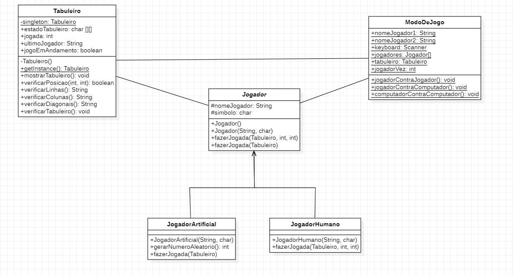

# Jogo da Velha - Java

Essa aplicação consiste no tradicional jogo da velha em que se jogam dois jogadores, cada um com o seu respectivo símbolo (X e O).
Feito com a linguagem Java usando Programação Orientada a Objetos.

## Classes da aplicação

- Main

    Classe principal que irá rodar a aplicação, o usuário escolhe o nome dos jogadores, o tipo de jogo e o jogo é iniciado logo em seguida.

- Jogador

    Classe que representa os jogadores, possuem atributos como o nome do jogador e o símbolo que ele irá utilizar, e funções necessárias para o jogador, como a de fazer a sua jogada.

- Tabuleiro

    Classe que representa o tabuleiro do jogo da velha, com todas as posições marcadas com os símbolos dos jogadores e também métodos para verificar o empate ou a vitória de algum jogador.

- ModoDeJogo

    Essa classe representa os tipos de jogos disponível: Jogador contra Jogador, Jogador contra Computador e Computador contra Computador

## Diagrama de classes

## Autor

Davi Bittencourt de Almeida - Estudante do curso de Sistemas de Informação da UFS